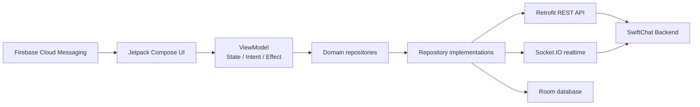
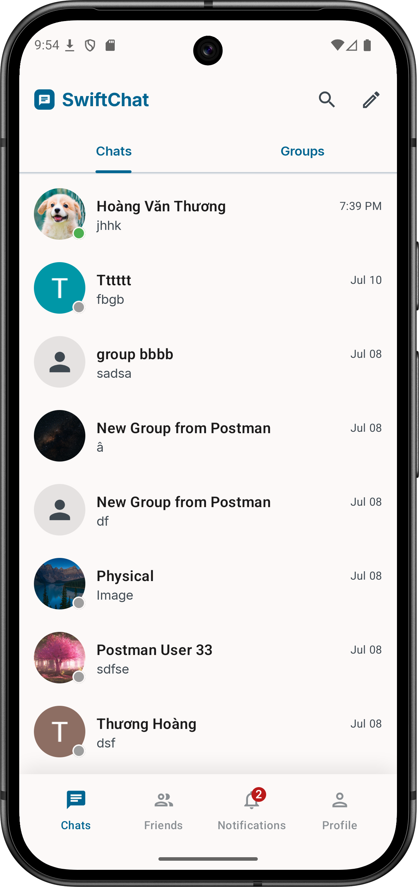
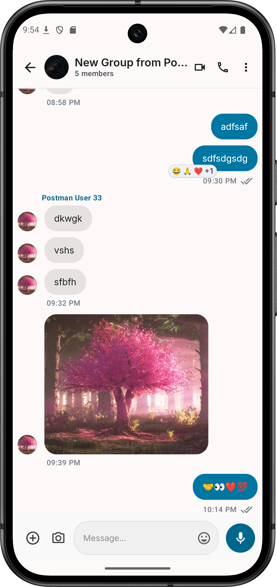
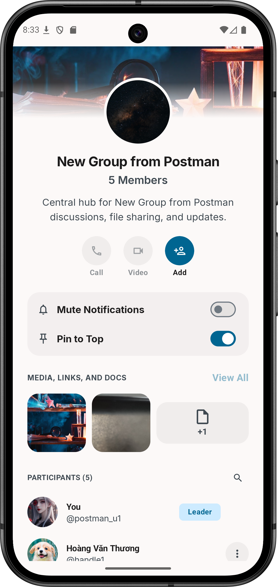
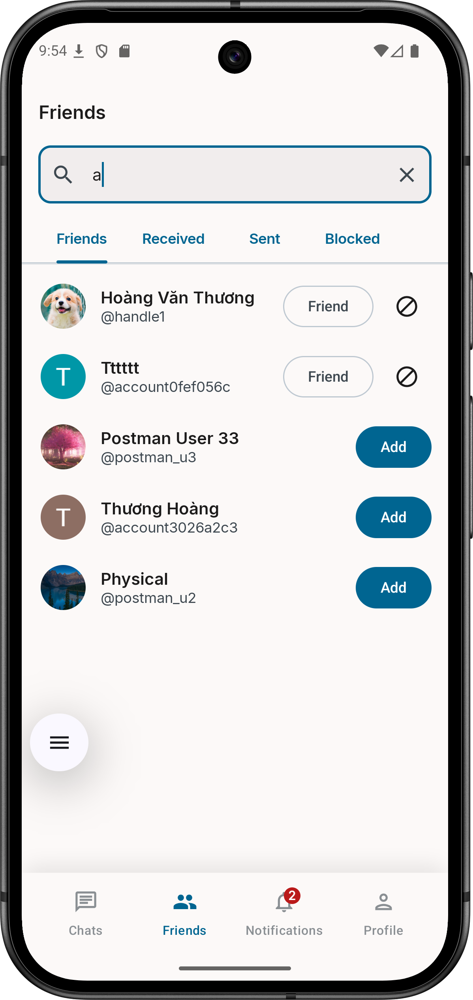
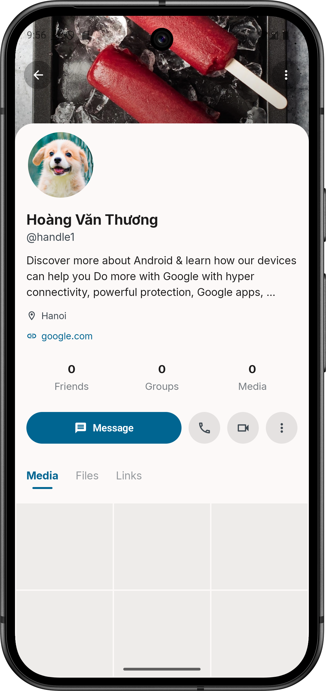
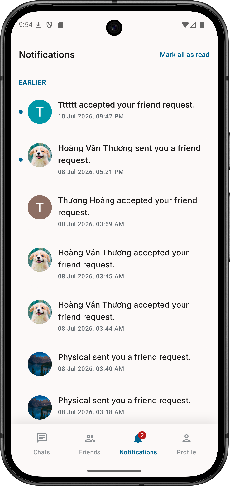
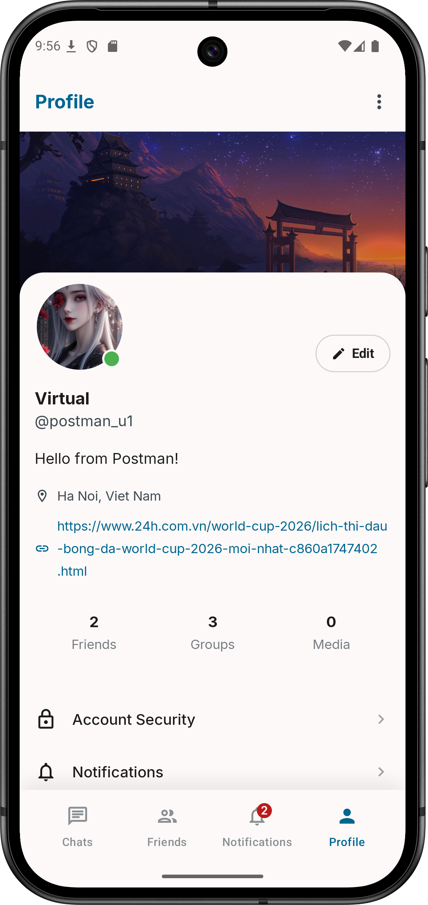

<div align="center">
  <h1>💬 SwiftChat Android</h1>
  <p><b>A real-time messaging application for Android</b></p>
  
  
  
  
  
  
</div>

---

**SwiftChat** is an Android application that supports real-time direct messaging and group conversations. It combines a **REST API**, **Socket.IO**, and **Room Database** to synchronize conversations, messages, friends, notifications, and user profiles.

The project uses **Jetpack Compose** for its user interface, **MVVM** architecture, **MVI**, **Hilt** for dependency injection, and encrypted on-device token storage.

> **Status:** This project is under active development. The primary flows are functional; voice/video calls, password recovery, the Media/Files/Links library, and some settings are still placeholders.

---

## 🌐 System overview

1. **Android application — this repository**
   - Renders the UI and manages authentication sessions and local data.
   - Calls the REST API with Retrofit.
   - Sends and receives real-time events through Socket.IO.
   - Receives push notifications through Firebase Cloud Messaging.

2. **SwiftChat Backend**
   - Provides APIs for authentication, users, friends, conversations, messages, and notifications.
   - Handles Socket.IO, presence, typing indicators, read receipts, and group events.
   - The backend is not included in this repository and must be started separately.

3. **Firebase and Google Identity**
   - Firebase Cloud Messaging delivers notifications to devices.
   - Firebase Analytics is integrated through the Firebase BoM.
   - Credential Manager and Google Identity support Google Sign-In.

4. **On-device data**
   - Room stores conversations, messages, reactions, attachments, read receipts, and notifications.
   - <code>EncryptedSharedPreferences</code> stores the access token, refresh token, account ID, and FCM token.

### Data flow



Room acts as the primary observable data source. Repositories synchronize data from the REST API into Room, process Socket.IO events, and update local data; the UI observes changes through Kotlin <code>Flow</code>.

---

## ✨ Key features

- Account registration, account or Google sign-in, and automatic session refresh.
- Real-time direct and group messaging with text, images, and files.
- Message reactions, unsending, deletion, pinning, and read receipts.
- User search, friend request management, and a block list.
- Group creation, member management, and group permissions.
- Push notifications through FCM.
- CRUD features

---

## 🛠️ Technology stack

- **Kotlin**, **Jetpack Compose**, **Material 3**
- **MVVM**,**Hilt**
- **Retrofit**, **OkHttp**, **Socket.IO**
- **Room Database**
- **Firebase Cloud Messaging**, **Google Auth**

---

## 📁 Project structure

```text
app/src/main/java/com/thuo_ng/swift_chat_android/
├── core/           # Authentication, network, notifications, sessions, sockets, storage, and utilities
├── data/
│   ├── local/      # Room database, DAOs, entities, and relations
│   ├── mapper/     # DTO, entity, and domain model conversions
│   ├── remote/     # Retrofit APIs and DTOs
│   └── repository/ # Repository implementations and data synchronization
├── di/             # Hilt modules
├── domain/         # Models, repository interfaces, and use cases
└── ui/             # Compose screens, ViewModels, contracts, navigation, and theme
```

---

## 📱 Screenshots

<div align="center">
  
  &nbsp;&nbsp;&nbsp;
  
  &nbsp;&nbsp;&nbsp;
  
  &nbsp;&nbsp;&nbsp;
  
  &nbsp;&nbsp;&nbsp;
  
  &nbsp;&nbsp;&nbsp;
  
  &nbsp;&nbsp;&nbsp;
  
</div>

---

## 🚀 Getting started

### Prerequisites

- **IDE:** An Android Studio version compatible with Android Gradle Plugin 9.2.1.
- **Android SDK:** Compile SDK 37 and Target SDK 35.
- **Device:** Android 8.0 or later — Min SDK API 26.
- **Build:** Gradle Wrapper 9.4.1; the project configures Gradle daemon JVM toolchain 25.
- **Backend:** A compatible SwiftChat Backend with REST API and Socket.IO support.
- **Services:** A Firebase project and OAuth 2.0 Web Client ID when using FCM or Google Sign-In.

### 1. Clone the repository

```bash
git clone https://github.com/Thuong-actvn/swift-chat-android.git
cd swift-chat-android
```

### 2. Configure BaseURL

Set BaseURL in buildConfigField

```kotlin
buildConfigField("String", "BASE_URL", "\"your_url\"")
```

### 3. Configure Google Sign-In

Add your OAuth Web Client ID to <code>local.properties</code>:

```properties
GOOGLE_CLIENT_ID=your-web-client-id.apps.googleusercontent.com
```

<code>local.properties</code> is already included in <code>.gitignore</code>, so this value must be configured on each development machine.

### 4. Configure Firebase

1. Create an Android app in Firebase Console with the package name <code>com.thuo_ng.swift_chat_android</code>.
2. Download <code>google-services.json</code>.
3. Place the file at <code>app/google-services.json</code>.
4. Enable Firebase Cloud Messaging and configure the required OAuth settings.

### 5. Run the application

1. Start the [SwiftChat Backend](#contributors).
2. Open the project in Android Studio.
3. Wait for Gradle Sync to complete.
4. Select an emulator or physical device.
5. Run the <code>app</code> configuration, or use the Gradle Wrapper.

Windows:

```powershell
.\gradlew.bat :app:assembleDebug
.\gradlew.bat :app:installDebug
```

macOS/Linux:

```bash
./gradlew :app:assembleDebug
./gradlew :app:installDebug
```

---

## ⚠️ Current status and limitations

- Voice and video calls have not been implemented.
- The password recovery flow has not been implemented.
- Profile settings
- Search messages

---

<a id="contributors"></a>

## 👨‍💻 Contributors

- **Android Developer / Maintainer:** [Thuong](https://github.com/Thuong-actvn)
- **Backend Developer / Maintainer:** [TrinhDacNhatMinh - SwiftChat Backend](https://github.com/TrinhDacNhatMinh/swiftchat-backend)

---

## 📄 License

- MIT license
